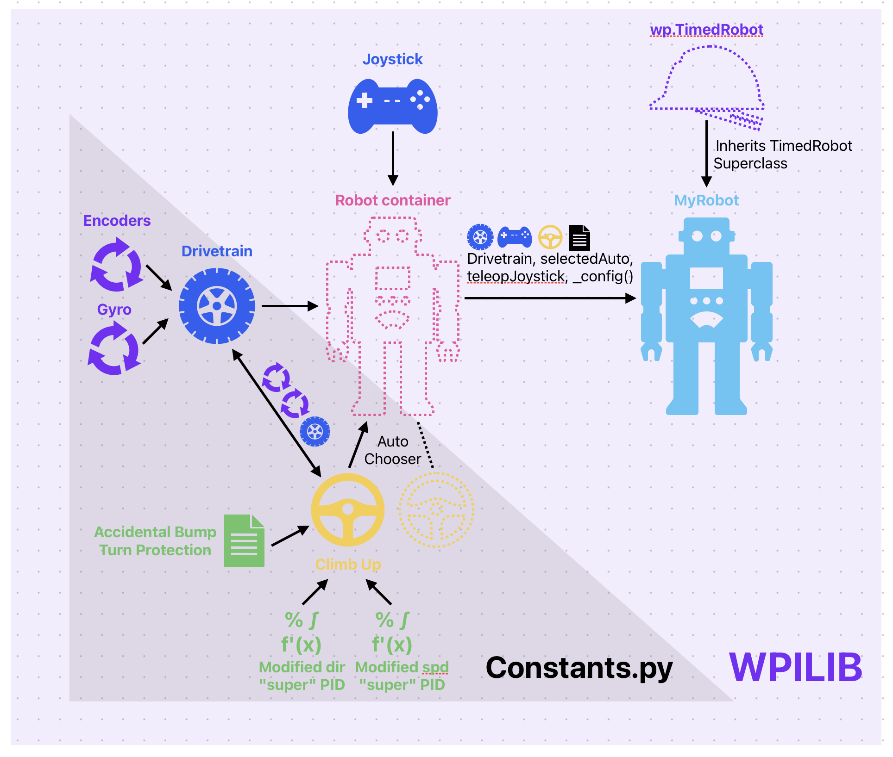

# CS570 Climb Up Project

*By William & Eric*

## Introduction
The goal of this project is to explore using PID controllers, as well the encoders and gyro of the ROMI to make it drive up a ramp. Our project involves a few core parts, namely, our robot code structure, the several PID controllers in climbup, and surprises along the way. 

## Robot Code Structure
Here is a diagram of our general code structure:
